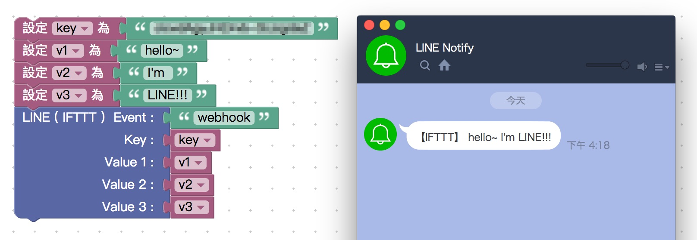
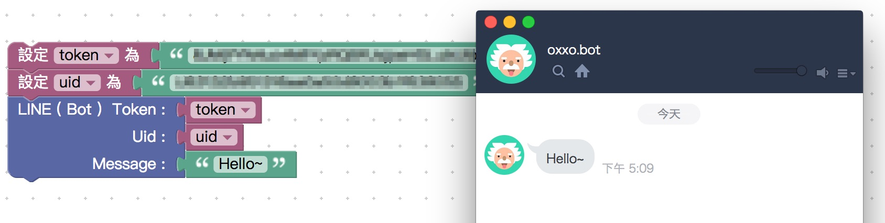

# LINE 推播積木

## IFTTT

註冊 IFTTT 後，設定 webhook event 並取得 key，就能透過 LINE IFTTT 積木發送訊息至 LINE Notify。

> Webduino 雲端平台：[https://cloud.webudino.io](https://cloud.webudino.io)
>
> 如何註冊 IFTTT 及原理參考：[IFTTT 發送 LINE 訊息通知](http://www.oxxostudio.tw/articles/201803/ifttt-line.html)

## LINE BOT

除了用 IFTTT，如果會設定 LINE 機器人，也可以透過 push message 的方式，讓機器人發送訊息給自己。

> 原理參考：[實作 LINE 聊天機器人 ( Google Apps Script )](http://www.oxxostudio.tw/articles/201804/line-bot-apps-script.html)

